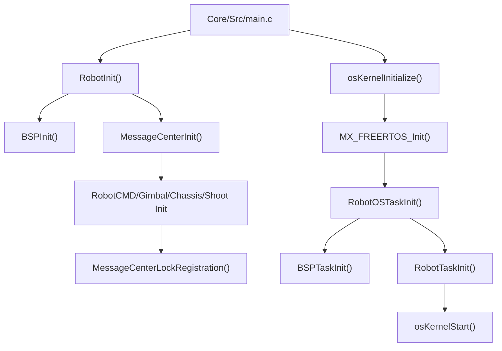

# APP 层当前架构

## 当前状态

`application` 已清除原有机器人的具体业务，只保留便于迁入新项目的任务和接口骨架。当前代码不会注册遥控器、上位机、IMU、电机或其他执行器实例，也不会产生机器人控制输出。

保留的 APP 入口如下：

- `robot.c/.h`：连接 Core、BSP、Module 和 APP 的总初始化入口。
- `robot_task.c/.h`：创建电机管理、daemon 和 APP 控制任务。
- `robot_def.h`：预留公共配置、枚举和跨 APP 消息结构的位置。
- `cmd/robot_cmd.c/.h`：控制输入与目标生成空框架。
- `gimbal/gimbal.c/.h`：云台控制空框架。
- `chassis/chassis.c/.h`：底盘控制空框架。
- `shoot/shoot.c/.h`：发射机构控制空框架。

## 启动流程



所有模块实例和消息 topic 应在 `RobotInit()` 的消息中心初始化与锁定之间完成注册。所有 RTOS 线程必须在
`osKernelInitialize()` 之后创建。

## 当前任务

| 任务            |      默认周期 | 优先级             | 当前职责                                               |
|---------------|----------:|-----------------|----------------------------------------------------|
| `motor_task`  |      1 ms | AboveNormal     | 调用 `MotorControlTask()`，统一调度已注册通信型电机；当前无实例         |
| `daemon_task` |     10 ms | Normal          | 调用 `DaemonTask()`，维护已注册在线检测实例；当前无实例                |
| `app_task`    |      5 ms | Normal          | 调用 `RobotTask()`，依次运行 cmd、gimbal、chassis、shoot 空入口 |
| BSP 后台任务      |  由 BSP 决定 | High/Normal/Low | 处理 CAN、BSP 延后事件和异步 Flash                           |
| `defaultTask` | CubeMX 配置 | Normal          | CubeMX 默认任务，保留 USB Device 等生成代码入口                  |

APP 控制顺序固定为：

```text
RobotCMDTask() -> GimbalTask() -> ChassisTask() -> ShootTask()
```

命令层先生成目标，执行 APP 再消费目标。后续如果改为不同任务，也应通过 `message_center` 交换快照，避免 APP 间直接共享可变全局变量。

## 迁移入口

- 初始化模块实例：填写对应 APP 的 `XXXInit()`。
- 周期状态机和目标更新：填写对应 APP 的 `XXXTask()`。
- 公共消息结构和配置：填写 `robot_def.h`。
- 新增或调整任务：修改 `robot_task.c`，优先按“同类驱动一个管理任务”组织。
- 添加源文件和头文件路径：同步修改根目录 `CMakeLists.txt`。

完整步骤参见 [参考项目迁入指南](参考项目迁入指南.md)。
