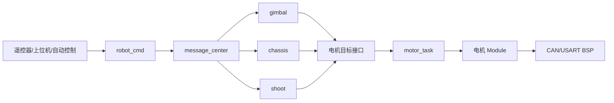

# 参考项目迁入指南

## 1. 迁移目标

当前 APP 层是一个可启动但没有具体机器人业务的基线。迁移时应保留现有 BSP 和 Module 边界，把参考项目的业务逐步落入 `cmd`、
`gimbal`、`chassis`、`shoot` 或新增 APP 中，避免整目录覆盖。

迁移完成后的推荐控制路径为：

## 2. 迁移前清单

先整理参考项目的以下信息，不要直接复制源文件：

- 板卡型号、外设句柄、引脚、DMA、中断和时钟配置。
- CAN/RS485/UART 总线归属、设备 ID 和波特率。
- 每个执行器的类型、控制模式、反馈源、减速比和方向。
- 每个任务的周期、优先级、栈大小和最坏执行时间。
- APP 之间传递的数据结构、生产者和消费者。
- 急停、离线、限位、上电零位和输出使能条件。

## 3. 分层映射

逐项判断参考代码应该进入哪一层：

| 参考代码内容           | 迁入位置                                   |
|------------------|----------------------------------------|
| HAL 外设操作、中断、DMA  | `bsp` 或 CubeMX 用户代码区                   |
| 电机/IMU/遥控器/上位机协议 | 对应 `modules`                           |
| PID、滤波、运动学通用实现   | `modules/algorithm` 或独立 module         |
| 模式切换、机器人状态机、目标生成 | `application`                          |
| APP 间共享控制与反馈数据   | `message_center` topic + `robot_def.h` |

如果当前工程已经存在对应驱动，应优先适配现有实例注册接口，不要把参考项目的第二套 CAN、USART 或电机驱动并行迁入。

## 4. 先迁初始化

按以下顺序填写 `RobotInit()` 调用到的空入口：

1. `RobotCMDInit()`：注册输入设备、上位机实例和命令 topic。
2. `GimbalInit()`：注册云台消息端点、传感器引用和电机实例。
3. `ChassisInit()`：注册底盘消息端点、电机和功能模块实例。
4. `ShootInit()`：注册发射消息端点、执行器和传感器实例。
5. 若新增 APP，在消息中心锁定前调用其初始化函数。

实例注册时一次性确定：

- 物理总线句柄和通信 ID。
- 控制模式与反馈源。
- 电机方向、减速比和单位换算。
- 直接输出类型或位置/速度间接控制方式。
- 所需 PID 参数和输出限幅。
- daemon 超时时间及离线回调。

## 5. 再迁周期逻辑

把参考项目永久循环中的单次业务拆到对应 `XXXTask()`：

- `RobotCMDTask()`：读取输入快照、更新模式和安全状态、发布目标。
- `GimbalTask()`：读取目标与姿态反馈、更新云台状态机、设置电机目标。
- `ChassisTask()`：读取目标、坐标变换、运动学解算、设置底盘执行器目标。
- `ShootTask()`：读取目标、执行安全互锁和发射状态机、设置执行器目标。

这些函数不得再次包含 `for (;;)` 或自行 `osDelay()`。周期由 `app_task` 统一提供。

## 6. 任务迁移

当前任务框架位于 `application/robot_task.c`：

| 任务            |    周期 | 用途                            |
|---------------|------:|-------------------------------|
| `motor_task`  |  1 ms | DJI/LK/HT/DM/DDT 等通信型电机统一管理   |
| `daemon_task` | 10 ms | 在线检测和离线回调                     |
| `app_task`    |  5 ms | cmd/gimbal/chassis/shoot 控制调度 |

参考项目中的任务应优先合并到上述三个任务。只有下列情况才新增专用任务：

- 传感器要求独立且严格的采样周期。
- 协议存在阻塞等待或较长解析过程，无法放入通用任务。
- 控制算法的频率或优先级明显不同于默认 APP 任务。
- 某类驱动需要独立的统一管理任务，而不是每个物理实例一个任务。

新增任务必须使用静态入口、明确栈大小和优先级，并检查 `osThreadNew()` 返回值。

## 7. 消息中心迁移

先画出生产者和消费者，再增加 topic。一个 topic 应对应一种稳定的数据语义，不要用同一结构承载无关命令。

推荐关系：

- `robot_cmd` 发布各执行 APP 的控制目标。
- `gimbal/chassis/shoot` 发布必要的状态反馈。
- 输入模块和设备驱动通过快照接口向所属 APP 提供数据，不直接跨 APP 写全局变量。

消息中心完成所有注册后会被 `MessageCenterLockRegistration()` 锁定，因此禁止在任务运行期临时注册 topic。

## 8. 硬件与通信核对

- 对照 CubeMX 生成的 `main.h`、`fdcan.c`、`usart.c`、`spi.c`、`i2c.c` 检查句柄。
- 检查 CAN 标准帧/扩展帧、收发 ID 和同总线 ID 冲突。
- 检查 RS485 收发方向控制、串口 DMA/IDLE 接收和波特率。
- 检查电机官方上位机中预设的模式是否与实例注册模式一致。
- APP 只设置目标，不直接调用 HAL 或重复实现通信发送。

## 9. 分阶段验证

建议按以下顺序逐步启用，每一步都先确认无意外输出：

1. 仅启动 BSP 和空任务框架。
2. 注册输入设备，只观察反馈，不发布执行目标。
3. 注册单个传感器并验证单位、方向和更新频率。
4. 注册单个电机，先保持禁用，再测试低幅值目标。
5. 迁入单个 APP 状态机。
6. 接入消息中心的其他 APP。
7. 最后启用整机联动、安全互锁和性能监测。

## 10. 完成检查表

- [ ] 旧项目没有直接复制第二套 BSP 驱动。
- [ ] 所有模块实例都在调度器启动前注册。
- [ ] 所有控制模式和 PID 参数在实例注册时固定。
- [ ] APP 周期函数无永久循环、无长时间阻塞。
- [ ] APP 之间没有共享可变全局变量。
- [ ] 关键模块均注册 daemon，并有明确安全状态。
- [ ] 电机、通信和任务周期不会造成总线或 CPU 过载。
- [ ] `CMakeLists.txt` 已加入新增源文件和 include 路径。
- [ ] 文档已记录硬件映射、消息 topic、任务周期和安全策略。
