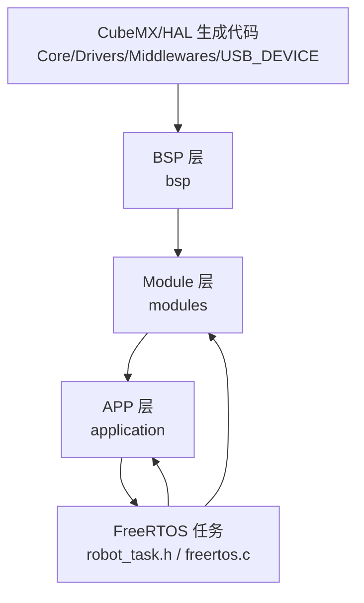
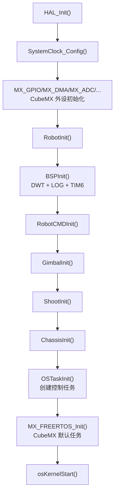
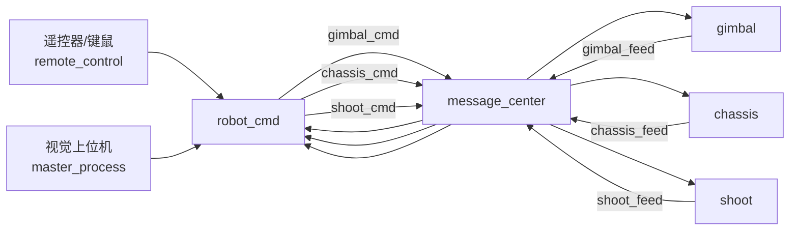
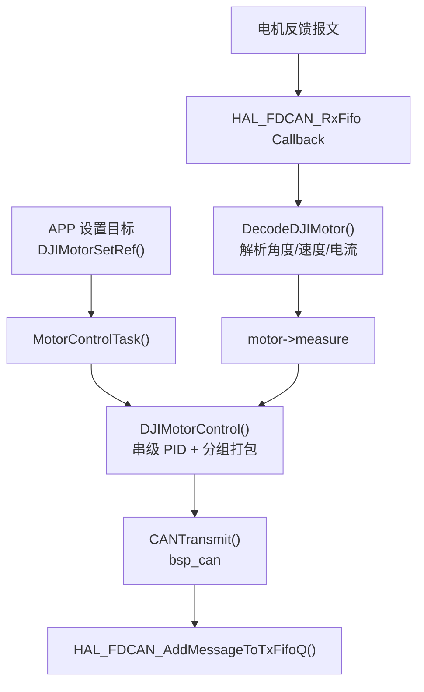

# control 项目架构说明

本文档基于当前 `control` 工程源码整理，并参考了 `.Doc/架构介绍与开发指南.md`、`README.md` 以及各层级已有说明文档。工程主体来自湖大跃鹿 RoboMaster 电控通用框架，并已移植到基于 STM32H723VGT6 的达妙 MC02 开发板。

## 1. 工程定位

`control` 是一个面向机器人整车控制的 STM32 嵌入式工程，使用 CubeMX 生成底层外设初始化代码，基于 HAL、FreeRTOS、CMSIS-DSP、SEGGER RTT 等组件构建。

当前应用层保留了典型 RoboMaster 步兵类机器人结构：

- `robot_cmd`：控制命令入口，解析遥控器、键鼠、视觉等输入。
- `gimbal`：云台控制，包含 yaw / pitch 电机和 IMU 姿态反馈。
- `chassis`：底盘控制，包含麦克纳姆轮运动解算、底盘电机、超级电容、裁判系统数据接口。
- `shoot`：发射机构控制，包含摩擦轮、拨弹盘等执行单元。

工程通过 `application/robot_def.h` 中的宏切换单板或双板模式。当前启用的是：

```c
#define ONE_BOARD
#define VISION_USE_UART
```

即单块主控控制整车，视觉链路使用 UART。

## 2. 总体分层

项目核心代码按 `BSP -> Module -> APP` 三层组织，上层通过下层提供的接口完成组合。



### 2.1 Core / Drivers / Middlewares / USB_DEVICE

这些目录主要由 CubeMX 或第三方库提供。

- `Core/Inc`、`Core/Src`：MCU 外设初始化、时钟、中断、FreeRTOS 默认入口等。
- `Drivers`：STM32H7 HAL、CMSIS、CMSIS-DSP 等。
- `Middlewares`：FreeRTOS、USB Device、SEGGER RTT 等。
- `USB_DEVICE`：USB CDC 相关配置和接口。

实际业务逻辑不建议写入这些目录，除非是 CubeMX 用户代码块或底层移植所需。

### 2.2 BSP 层

目录：`bsp`

BSP 是对 STM32 HAL 的进一步封装，是非 CubeMX 代码中最靠近硬件的一层。除 BSP 外，其他层原则上不直接调用 `HAL_...`。

当前 BSP 包含：

- `bsp_init.c/.h`：BSP 统一初始化入口，目前初始化 DWT、日志和 TIM6 DWT 时间轴维护中断。
- `can`：FDCAN/CAN 注册、过滤器配置、收发和回调分发。
- `usart`：串口注册、DMA/IT 接收发送封装。
- `spi`、`iic`、`gpio`、`pwm`、`adc`、`dwt`、`flash`、`usb` 等外设封装。
- `bsp_service`：统一处理 BSP 延后事件,短回调在 BSP 服务任务中执行,长耗时业务由 module 或 application 自己创建任务。

BSP 的典型设计是 `XXXInstance + XXXRegister()`。例如 `CANRegister()` 会分配 `CANInstance`，保存 CAN 句柄、收发 ID、收发缓存和模块回调函数；收到 CAN 报文后，BSP 遍历已注册实例，根据 `can_handle + rx_id` 找到对应实例，再调用模块层传入的解析回调。

### 2.3 Module 层

目录：`modules`

Module 层把外部设备、通信协议和通用算法封装成硬件无关接口，供 APP 层直接使用。

主要类别：

- 电机：`motor/DJImotor`、`motor/HTmotor`、`motor/LKmotor`、`motor/DMmotor`、`step_motor`、`servo_motor`。
- 传感器与功能模块：`imu`、`BMI088`、`TFminiPlus`、`lcd`、`super_cap`、`alarm`。
- 通信与协议：`remote`、`master_machine`、`can_comm`、`referee`、`bluetooth`、`unicomm`。
- 应用支撑：`message_center`、`daemon`、`standard_cmd`。
- 算法：`algorithm`，包含 PID、卡尔曼滤波、CRC、四元数 EKF 等。

Module 层的关键特点：

- 由 APP 初始化具体实例，不存在“全模块统一初始化”。
- 通信类模块通常包含一个 BSP instance，并把解析函数注册给 BSP。
- 电机类模块统一由 `modules/motor/motor_task.c` 周期调度控制输出。
- `message_center` 提供发布-订阅机制，解耦应用之间的数据交换。
- `daemon` 用作离线检测和异常回调，例如电机、视觉通信等可注册守护实例。

### 2.4 APP 层

目录：`application`

APP 是整车控制逻辑层，负责把机器人结构和任务逻辑组织起来。当前 APP 层由以下核心文件组成：

- `robot.c` / `robot.h`：整车初始化入口和周期任务入口。
- `robot_task.h`：创建并定义 FreeRTOS 中持续运行的基础任务。
- `robot_def.h`：板型、机器人参数、控制模式枚举、应用间消息结构定义。
- `cmd/robot_cmd.c`：命令解析与发布。
- `gimbal/gimbal.c`：云台控制。
- `chassis/chassis.c`：底盘控制。
- `shoot/shoot.c`：发射机构控制。

APP 层各应用之间不相互包含，不直接调用彼此函数，而是通过 `message_center` 的话题传递数据。

## 3. 启动与初始化流程

程序入口在 `Core/Src/main.c`。初始化顺序如下：



`RobotInit()` 会先关闭中断，防止初始化过程中出现未准备好的中断回调；完成 BSP、应用和任务创建后再重新开启中断。

当前 `ONE_BOARD` 模式下，`RobotInit()` 会初始化：

- `RobotCMDInit()`
- `GimbalInit()`
- `ShootInit()`
- `ChassisInit()`
- `OSTaskInit()`

如果切换为双板模式，`robot.c` 会根据 `CHASSIS_BOARD` / `GIMBAL_BOARD` 条件编译，只初始化当前板负责的应用。

## 4. FreeRTOS 任务模型

`application/robot_task.h` 是本工程实际控制任务的创建位置。虽然 `Core/Src/freertos.c` 中仍有 CubeMX 默认任务，但主要业务任务由 `OSTaskInit()` 创建。

| 任务 | 周期 | 主要职责 |
| --- | --- | --- |
| `StartINSTASK` | 1 ms | 初始化并运行 IMU 姿态解算，更新视觉发送姿态数据 |
| `StartMOTORTASK` | 1 ms | 调用 `MotorControlTask()`，集中计算并发送电机控制报文 |
| `StartDAEMONTASK` | 10 ms | 调用 `DaemonTask()` 和 `BuzzerTask()`，处理离线检测与报警 |
| `StartROBOTTASK` | 5 ms | 调用 `RobotTask()`，周期执行 cmd/gimbal/shoot/chassis 应用逻辑 |
| `StartUITASK` | 1 ms | 裁判系统 UI 初始化与刷新 |
| `defaultTask` | 1 ms delay | CubeMX 默认任务，当前用于 USB Device 初始化 |

任务关系可以理解为：

- `RobotTask()` 负责生成目标值和状态机逻辑。
- `MotorControlTask()` 负责把目标值转换为实际电流/控制报文。
- `INS_Task()` 负责提供姿态反馈。
- `DaemonTask()` 负责模块健康状态。
- `UITask()` 负责裁判系统 UI 通信。

## 5. 应用间数据流

单板模式下，应用间数据通过 `message_center` 传递。



`robot_def.h` 中定义了这些消息结构：

- `Chassis_Ctrl_Cmd_s`：底盘速度、旋转速度、底盘模式、云台偏移角等。
- `Gimbal_Ctrl_Cmd_s`：云台 yaw、pitch、云台模式等。
- `Shoot_Ctrl_Cmd_s`：发射、摩擦轮、弹舱盖、拨弹模式、弹速、射频等。
- `Chassis_Upload_Data_s`：底盘、裁判系统、热量、弹速、敌方颜色等反馈。
- `Gimbal_Upload_Data_s`：云台 IMU 姿态和 yaw 电机单圈角度。
- `Shoot_Upload_Data_s`：预留的发射反馈数据。

双板模式下，`robot_cmd` 与 `chassis` 之间会改用 `can_comm` 通过 CAN 传递结构体数据。

## 6. 核心应用职责

### 6.1 robot_cmd

文件：`application/cmd/robot_cmd.c`

`robot_cmd` 是整车控制命令的入口，主要负责：

- 初始化遥控器 `RemoteControlInit(&huart5)`。
- 初始化视觉通信 `VisionInit(&huart9)`。
- 注册 `gimbal_cmd`、`shoot_cmd`、`chassis_cmd` 发布者。
- 订阅 `gimbal_feed`、`shoot_feed`、`chassis_feed`。
- 根据遥控器开关选择遥控器模式或键鼠模式。
- 计算云台与底盘零位夹角 `offset_angle`。
- 处理急停逻辑。
- 发布三个执行应用的目标命令。

它只生成控制目标，不直接操作底盘、云台、发射机构电机。

### 6.2 gimbal

文件：`application/gimbal/gimbal.c`

云台应用负责 yaw / pitch 两轴控制：

- 初始化 `INS_Init()` 获取 IMU 姿态指针。
- 初始化两个 DJI GM6020 电机。
- 将 IMU 姿态或角速度作为电机外部反馈源。
- 订阅 `gimbal_cmd`，根据模式设置电机使能、反馈源和目标角度。
- 发布 `gimbal_feed`，回传 IMU 姿态和 yaw 电机单圈角度。

当前 `GIMBAL_GYRO_MODE` 与 `GIMBAL_FREE_MODE` 都实际使用外部反馈，代码中也标注了后续可能统一为 IMU 控制。

### 6.3 chassis

文件：`application/chassis/chassis.c`

底盘应用负责麦克纳姆轮底盘控制：

- 初始化四个 M3508 底盘电机。
- 初始化裁判系统 UI 数据接口。
- 初始化超级电容模块。
- 单板模式下订阅 `chassis_cmd`、发布 `chassis_feed`。
- 根据底盘模式设置 `wz`：不跟随、跟随云台、小陀螺、零力。
- 根据云台偏移角将速度命令从云台坐标系投影到底盘坐标系。
- 通过麦克纳姆正运动学计算四轮目标速度。
- 调用 `DJIMotorSetRef()` 设置电机参考值。

当前功率限制、真实速度估计、部分裁判系统反馈填充仍保留 TODO 或注释。

### 6.4 shoot

文件：`application/shoot/shoot.c`

发射应用负责摩擦轮和拨弹盘：

- 初始化两个 M3508 摩擦轮电机。
- 初始化一个 M2006 拨盘电机。
- 订阅 `shoot_cmd`，发布 `shoot_feed`。
- 根据 `SHOOT_OFF` 急停所有发射相关电机。
- 根据 `load_mode` 切换拨盘速度环或角度环，实现停止、单发、三连发、连发、反转等模式。
- 根据 `friction_mode` 和 `bullet_speed` 设置摩擦轮速度。

当前摩擦轮弹速映射参数、弹舱盖舵机、卡弹检测等仍待补充。

## 7. 电机控制链路

本工程的电机链路体现了典型的 `APP -> Module -> BSP -> HAL` 结构。

以 DJI 电机为例：



关键点：

- APP 只设置目标值，不直接发送 CAN。
- `DJIMotorInit()` 会注册电机实例、计算 DJI 电机收发 ID、注册 CAN 回调、注册 daemon 离线检测。
- `DJIMotorControl()` 遍历所有已注册电机实例，按配置执行角度环、速度环、电流环。
- DJI 电机控制报文按 CAN 总线和分组 ID 打包，最多四个电机共用一帧控制报文。
- 收到反馈时由 `bsp_can` 分发到 `DecodeDJIMotor()`，更新 `measure`，再供下一个控制周期使用。

## 8. 姿态与视觉链路

IMU 姿态解算位于 `modules/imu/ins_task.c`：

- `INS_Init()` 初始化 BMI088、PWM 恒温、EKF 初始四元数和温控 PID。
- `INS_Task()` 以 1 kHz 运行，读取 BMI088，加速度和陀螺仪进入四元数 EKF，更新 yaw/pitch/roll、运动加速度等。
- `VisionSetAltitude()` 将姿态写入视觉发送结构体。

视觉通信位于 `modules/master_machine/master_process.c`：

- 当前使用 `VISION_USE_UART`。
- `VisionInit(&huart9)` 注册串口接收实例，并注册 daemon 离线重启回调。
- `DecodeVision()` 解析视觉接收数据。
- `VisionSend()` 使用 seasky 协议打包 yaw/pitch/roll 等数据并通过串口发送。

需要注意：当前 `robot_task.h` 中 `StartINSTASK()` 调用了 `VisionSend()`，`RobotCMDTask()` 末尾也调用了 `VisionSend()`，两处发送节奏和接口参数存在历史演进痕迹，后续整理视觉链路时建议统一发送入口。

## 9. 消息中心设计

文件：`modules/message_center/message_center.c`

`message_center` 是轻量发布-订阅机制：

- `PubRegister(name, data_len)`：注册或查找话题发布者。
- `SubRegister(name, data_len)`：注册订阅者，并为其分配环形队列。
- `PubPushMessage(pub, data_ptr)`：向该话题所有订阅者队列推送一份数据拷贝。
- `SubGetMessage(sub, data_ptr)`：从订阅者队列取出一条消息。

设计优点：

- APP 之间不直接包含彼此头文件，减少耦合。
- 同一话题可有多个订阅者。
- 消息内容按结构体拷贝，接口简单。

需要注意：

- 当前使用 `malloc()` 动态分配话题和队列，适合初始化阶段完成注册，不建议运行中频繁创建。
- 代码中的 `sub->front_idx = (sub->front_idx++) % QUEUE_SIZE;` 有可疑的自增写法，后续维护时建议重点检查队列出队索引是否符合预期。
- `data_len` 使用 `uint8_t`，较大消息结构需要留意长度上限。

## 10. 双板兼容方式

双板模式通过 `robot_def.h` 中板型宏和 APP 内部条件编译实现：

- `ONE_BOARD`：单板控制整车，应用之间通过 `message_center` 传递。
- `GIMBAL_BOARD`：云台板，初始化 `robot_cmd`、`gimbal`、`shoot`，与底盘板通过 `can_comm` 交换底盘命令和反馈。
- `CHASSIS_BOARD`：底盘板，初始化 `chassis`，接收云台板命令并回传底盘数据。

当前代码中 `robot_cmd` 和 `chassis` 对双板通信的收发 ID 分别为：

- 云台板发送底盘控制：`0x312`，接收底盘反馈：`0x311`。
- 底盘板发送底盘反馈：`0x311`，接收底盘控制：`0x312`。

切换双板时需要同时检查 CAN 总线归属、ID 冲突、数据结构长度和物理接线。

## 11. 目录职责速览

| 目录/文件 | 职责 |
| --- | --- |
| `Core/Src/main.c` | MCU 初始化入口，调用 `RobotInit()` 并启动 FreeRTOS |
| `Core/Src/freertos.c` | CubeMX FreeRTOS 默认配置，当前主要创建 defaultTask |
| `application/robot.c` | 整车初始化与整车周期任务入口 |
| `application/robot_task.h` | 创建 INS、电机、daemon、robot、UI 等任务 |
| `application/robot_def.h` | 板型宏、机器人机械参数、控制枚举、消息结构 |
| `application/cmd` | 控制命令解析与发布 |
| `application/gimbal` | 云台姿态闭环和电机目标设置 |
| `application/chassis` | 底盘模式、坐标变换、运动学解算 |
| `application/shoot` | 摩擦轮、拨弹盘、发射模式 |
| `modules/message_center` | APP 发布-订阅通信 |
| `modules/motor` | 电机实例、反馈解析、串级 PID、控制报文发送 |
| `modules/imu` | BMI088 姿态解算任务 |
| `modules/master_machine` | 视觉上位机通信 |
| `modules/daemon` | 模块离线检测和回调 |
| `bsp` | HAL 外设封装和实例注册 |
| `.Doc` | 原框架说明、开发规范、调试和使用文档 |
| `doc` | 当前项目补充说明文档 |

## 12. 开发与维护建议

1. 新增整车功能优先放在 `application`，由 APP 组合已有 module，不要绕过 module 直接访问 HAL。
2. 新增外部设备优先封装为 `modules/xxx`，通过 `XXXInit()` 或 `XXXRegister()` 返回实例指针。
3. 新增底层外设能力放在 `bsp/xxx`，保持 BSP 作为唯一直接接触 HAL 的业务层。
4. 应用间通信优先使用 `message_center`；双板跨板通信可参考 `can_comm`。
5. 初始化应在 `RobotInit()` 阶段完成，避免在周期任务第一次运行时才初始化依赖定时器或通信中断的模块。
6. 修改 `robot_def.h` 后必须重新编译，且 `ONE_BOARD`、`CHASSIS_BOARD`、`GIMBAL_BOARD` 三者只能启用一个。
7. 电机 ID、CAN 总线、UART 句柄等硬件绑定参数分散在各 APP 的初始化配置中，改硬件连接时要同步检查。
8. 后续若继续服务“矩形框识别小车”场景，可以逐步把步兵机器人相关的 `gimbal/shoot/referee` 裁剪或隔离，把视觉识别结果、底盘运动控制和执行策略整理成更贴合小车任务的 APP。
