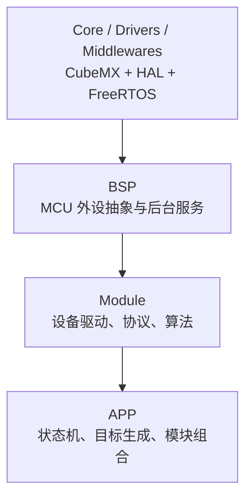
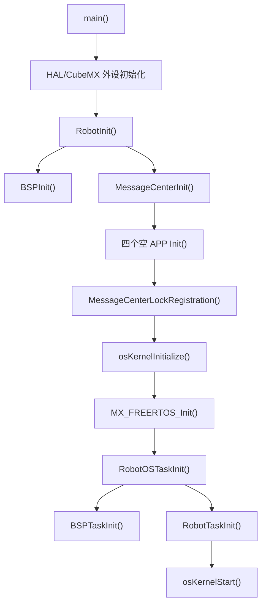
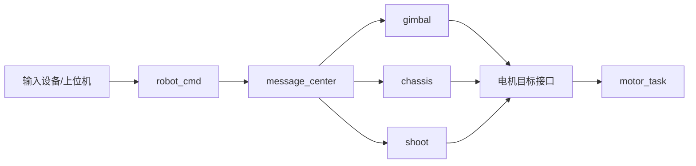

# gimbal 项目架构说明

## 1. 当前工程定位

本工程是基于 STM32H723、HAL、FreeRTOS 和 CMSIS-RTOS2 的三层嵌入式机器人框架，代码按 `BSP -> Module -> APP` 组织。

当前 APP 层已经移除原有步兵机器人具体业务，只保留可运行的空任务和接口骨架，作为后续迁入参考项目的基线。现阶段不会注册具体输入设备、电机、传感器或机器人执行器实例。

## 2. 分层职责



### 2.1 BSP

`bsp` 是唯一直接接触 HAL 的非生成代码层，主要包括 CAN、USART、SPI、IIC、PWM、GPIO、Flash、DWT、日志和统一延后处理服务。

关键入口：

- `BSPInit()`：调度器启动前初始化 DWT、日志、BSP 服务、片内 Flash 和 TIM6 时间轴维护。
- `BSPTaskInit()`：创建 CAN 处理、BSP 延后事件和异步 Flash 后台任务，并建立 SPI/IIC RTOS 对象。

### 2.2 Module

`modules` 封装外部设备、协议和通用算法，通过实例注册接口供 APP 使用。

- 电机：DJI、LK、HT、DM、DDT、步进电机和舵机。
- IMU：板载 BMI088 与外部 DM-IMU。
- 通信：遥控器、上位机、板间 CAN 通信和消息中心。
- 基础能力：daemon、日志配套、LCD、超级电容和算法库。
- `modules/referee` 已弃用，只保留历史源码，不参与构建。

### 2.3 APP

`application` 当前只保留迁移骨架：

| 文件 | 当前职责 |
| --- | --- |
| `robot.c/.h` | 初始化总入口和一次 APP 控制调度入口 |
| `robot_task.c/.h` | 创建电机、daemon 和 APP 控制任务 |
| `robot_def.h` | 预留公共配置、枚举和跨 APP 消息结构 |
| `cmd/robot_cmd.c/.h` | 输入与目标生成空框架 |
| `gimbal/gimbal.c/.h` | 云台控制空框架 |
| `chassis/chassis.c/.h` | 底盘控制空框架 |
| `shoot/shoot.c/.h` | 发射机构控制空框架 |

上述四个 APP 当前均不包含具体业务，也不注册任何 module 实例。

## 3. 启动流程



`RobotInit()` 在调度器启动前执行。模块实例和消息 topic 必须在消息中心锁定前完成注册。`RobotOSTaskInit()` 在内核初始化后创建运行期任务。

## 4. 当前任务模型

| 任务 | 周期 | 优先级 | 职责 |
| --- | ---: | --- | --- |
| CAN 处理任务 | 事件驱动 | High | 处理 CAN 接收事件和后台发送 |
| BSP 服务任务 | 事件驱动 | Normal | 处理 USART 等 BSP 延后回调 |
| 异步 Flash 任务 | 事件驱动 | Low | 处理异步 Flash 请求 |
| `motor_task` | 1 ms | AboveNormal | 调用 `MotorControlTask()` 统一管理通信型电机 |
| `daemon_task` | 10 ms | Normal | 调用 `DaemonTask()` 维护在线状态 |
| `app_task` | 5 ms | Normal | 调用 `RobotTask()` 执行 APP 空框架 |
| `defaultTask` | CubeMX 配置 | Normal | 保留生成代码的默认任务入口 |

当前任务可以正常运行，但没有已注册业务实例，因此 `motor_task`、`daemon_task` 和四个 APP 入口不会产生控制效果。

## 5. APP 调度与数据流

`RobotTask()` 当前固定按以下顺序调用：

```text
RobotCMDTask() -> GimbalTask() -> ChassisTask() -> ShootTask()
```

迁入业务后推荐使用 `message_center` 解耦：



`robot_cmd` 只生成目标和安全状态；执行 APP 负责状态机、运动学和目标设置；实际通信由对应 module 及驱动管理任务完成。

## 6. 电机控制边界

通信型电机的推荐路径为：

```text
APP 设置目标
    -> 电机 Module 保存目标
    -> motor_task 周期调用 MotorControlTask()
    -> 各类型电机 Control() 生成协议报文
    -> CAN/RS485 BSP 异步收发
```

不同电机不需要统一成一个控制函数，但应保持一致的架构：注册时固定总线、ID、模式、反馈源、方向和 PID 配置；运行期 APP 只调用对应模式的目标设置接口。

## 7. 消息中心

`message_center` 使用静态 topic、subscriber 和 Queue 存储。推荐把 Queue 深度为 1 的 topic 作为“最新值邮箱”，避免控制命令积压。

迁入新业务时：

1. 在消息中心枚举中增加 topic。
2. 在 `robot_def.h` 定义跨 APP 数据结构。
3. 在各 APP 的 `Init()` 中注册发布者和订阅者。
4. 在 `MessageCenterLockRegistration()` 前完成全部注册。

## 8. 迁移原则

- 不整目录覆盖当前 BSP 或 Module。
- 参考项目的 HAL 操作迁入 BSP，设备协议迁入 Module，状态机迁入 APP。
- 优先使用现有 CAN、USART、电机、IMU、daemon 和消息中心实例接口。
- 同类驱动共用管理任务，不为每个物理实例创建线程。
- APP 周期入口只执行一次更新，不包含永久循环或长时间阻塞。
- 所有执行器在初始化阶段保持安全禁用状态。
- 新增任务必须记录周期、优先级、栈大小和数据交换方式。

详细迁移步骤见 [application/参考项目迁入指南.md](../application/参考项目迁入指南.md)。

## 9. 目录职责速览

| 目录/文件 | 职责 |
| --- | --- |
| `Core` | CubeMX 生成的启动、外设初始化和中断入口 |
| `Drivers` / `Middlewares` | HAL、CMSIS、FreeRTOS 和第三方库 |
| `bsp` | MCU 外设抽象、异步传输和后台服务 |
| `modules` | 外部设备、通信协议和通用算法 |
| `application` | 当前为空业务迁移骨架，后续承载机器人控制逻辑 |
| `application/robot.c` | 调度器前初始化与 APP 调度顺序 |
| `application/robot_task.c` | APP 层任务创建和周期设置 |
| `application/参考项目迁入指南.md` | 后续业务迁移步骤与检查表 |
